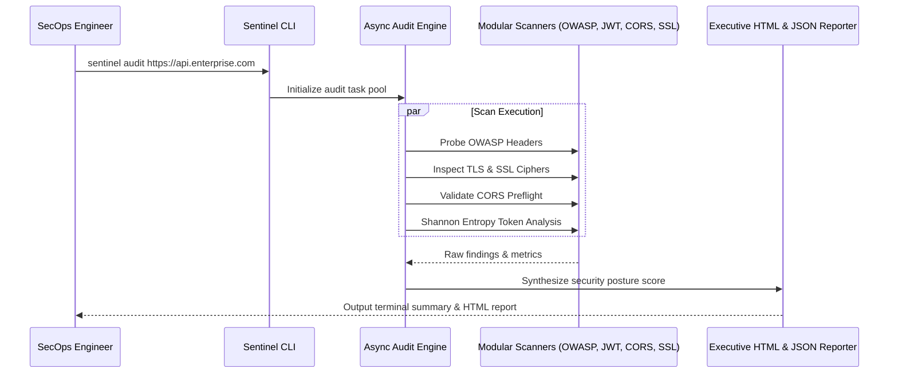

# Sentinel Architecture Flow

```mermaid
sequenceDiagram
    participant User as SecOps Engineer
    participant CLI as Sentinel CLI
    participant Engine as Async Audit Engine
    participant Scanners as Modular Scanners (OWASP, JWT, CORS, SSL)
    participant Reporter as Executive HTML & JSON Reporter

    User->>CLI: sentinel audit https://api.enterprise.com
    CLI->>Engine: Initialize audit task pool
    par Scan Execution
        Engine->>Scanners: Probe OWASP Headers
        Engine->>Scanners: Inspect TLS & SSL Ciphers
        Engine->>Scanners: Validate CORS Preflight
        Engine->>Scanners: Shannon Entropy Token Analysis
    end
    Scanners-->>Engine: Raw findings & metrics
    Engine->>Reporter: Synthesize security posture score
    Reporter-->>User: Output terminal summary & HTML report
```
